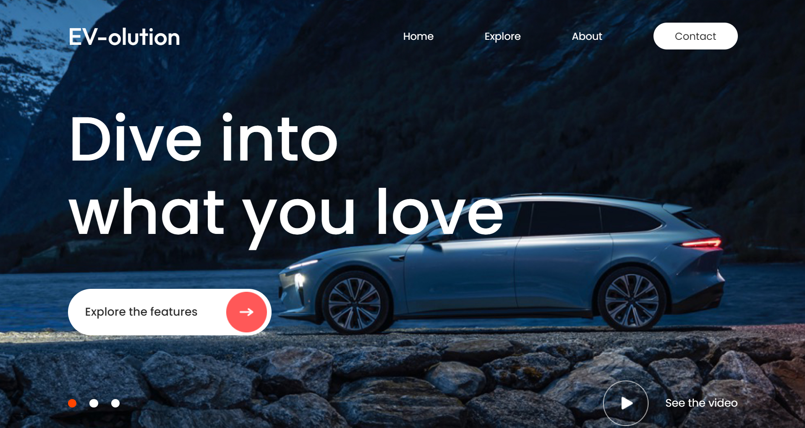
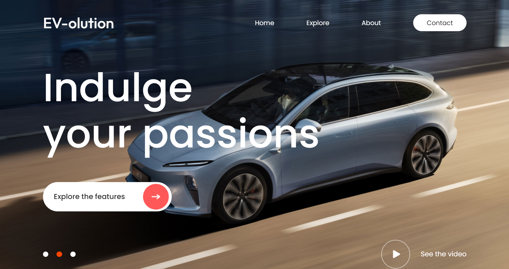
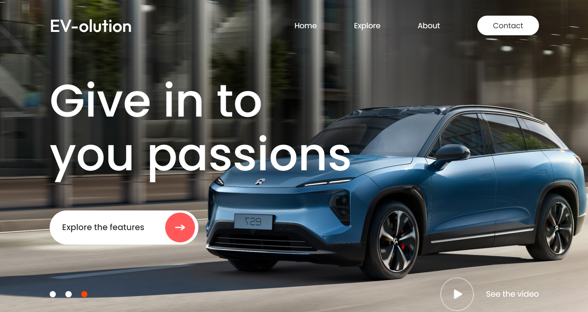
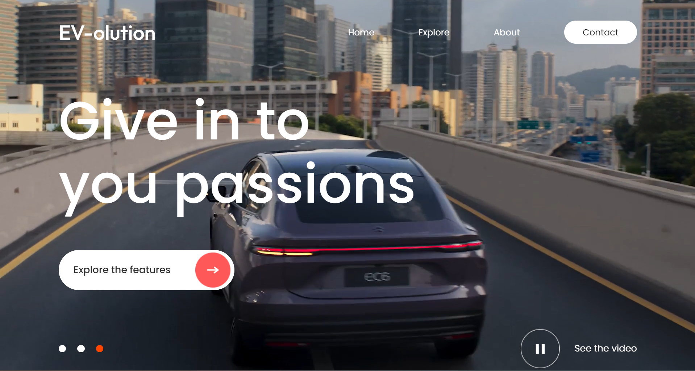

# EV-Website

This project is a responsive web application that utilizes **React.js** for the front end, along with **CSS** for styling. It features components such as a **Navbar**, **Hero section**, and a **Background**, each designed to provide a seamless user experience.

## Here is a preview of the website design:

## Technologies Used

-  **React.js**: The core JavaScript library used for building the user interface.
-  **CSS3**: Custom styling to enhance the visual appeal, including animations like `fadeIn`.
-  **JavaScript (ES6)**: Used for managing states, rendering components, and controlling dynamic behaviour like hero section animations.

### Key Components

- **Navbar**: A flexible and responsive navigation bar built with React and styled using CSS for optimal layout and interaction.
- **Hero Section**: Displays dynamic content that changes periodically using `useState` and `useEffect` hooks.
- **Background**: A responsive background that adapts to screen sizes and includes smooth animations.

## Contact Me

If you have any questions or would like to collaborate, feel free to connect with me via email at [cleonefoo@gmail.com](mailto:cleonefoo@gmail.com).

